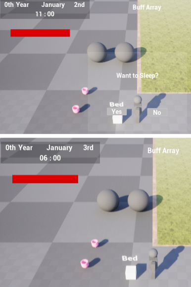

## 목차

1. [ProjectLife](#projectlife)
2. [Inventory System](#inventory-system)
3. [InventoryComponent](#inventorycomponent)
4. [InventoryUI](#inventory-ui)
5. [Drag Drop](#drag-drop)
6. [Shop](#shop)
7. [Crafting](#crafting)
8. [Dungeon Puzzle](#dungeon-puzzle)

# ProjectLife

농장 시뮬레이션과 던전 탐험 및 퍼즐 게임을 합쳐 다양한 요소를 즐길 수 있는 게임을 개발하고자 시작한 프로젝트.

# Inventory System

인벤토리는 FItemSlotData라는 정보를 배열로 저장한다.

현재 FItemSlotData는 (아이템 이름, 개수) 정보를 가지고 있으며, 실제 아이템 정보는 FItemData의 데이터 테이블에서 실제 아이템 정보를 불러오는 기능을 가지고 있다.

# InventoryComponent

UInventoryComponent는 실질적인 인벤토리 기능을 담당한다.

인벤토리를 보유하는 Actor는 현재 ABasicPlayerController, AStorageBox, ACookActor이다.

1. 플레이어는 캐릭터가 인벤토리를 보유하는 것이 아니라 PlayerController가 보유하여 컨트롤하는 캐릭터가 바뀌어도 인벤토리는 같은 것을 사용할 수 있도록 했다.
2. AStorageBox는 맵에 존재하는 보관함으로 인벤토리를 보유한다.
3. ACookActor는 제조 기능(요리)을 위해 인벤토리에서 아이템을 보유하고, ACookActor의 인벤토리에 있는 재료를 기반으로 제작해 준다.

추후 다른 Actor들도 인벤토리를 보유할 수도 있으므로, 컴포넌트를 추가만으로 인벤토리의 다양한 기능을 쉽게 적용할 수 있다.

UInventoryComponent는 OnInventoryDataChanged를 통해 인벤토리의 데이터의 변경이 있을 시에 Broadcast()하여 인벤토리의 내용을 출력하는 UI들의 내용을 변경시켜 준다.

# Inventory UI

Inventory UI는 크게 UInventoryWidget 과 UItemSlot으로 구성되어 있다.
UInventoryWidget은 UItemSlot을 여러 개 보유한 컨테이너의 개념이며, UItemSlot은 UInventoryComponent 안에 있는 아이템 정보를 출력 및 사용을 위한 버튼형 슬롯이다.
플레이어 인벤토리와 보관함 등의 서로 다른 아이템 공간에 Drag Drop으로 아이템을 옮길 수 있다.

다음 예시는 UInventoryWidget의 코드의 일부.
UpdateInventoryWidget()은 UInventoryWidget가 보유한 UItemSlot들을 TArray<UItemSlot*> 형태로 보유하고 있으며 이 슬롯들의 정보를 갱신시켜주는 역할을 한다.
InitInventoryWidget()에서 인벤토리 UI를 초기화하고, UInventoryComponent의 Delegate에 UpdateInventoryWidget()을 bind한다.
인벤토리의 데이터가 바뀔 때마다 Delegate를 Broadcast()하여 UpdateInventoryWidget()가 호출된다.

# Drag Drop

위의 이미지처럼 Drag Drop을 구현하여 인벤토리 내부를 정리할 수 있다.

UItemSlot::NativeOnDragDetected()의 코드 일부.

유저가 인벤토리 슬롯을 드래그하면 슬롯의 데이터를 그대로 복사한다.

이 작업을 하면 유저가 슬롯에 마우스 커서를 올리고 클릭한 뒤에 마우스를 움직이면 아이템 슬롯이 드래그 되며 마우스를 따라다닌다.

UItemSlot::NativeOnDrop()의 코드 일부.

위에서 만들어진 Drag가 다른 UItemSlot의 위에 놓인다면 두 슬롯의 데이터를 서로 바꾸는 기능을 한다.

# Shop

위의 이미지처럼 푸른 실린더 액터에 Interact()하면 위의 이미지처럼 상점 UI가 나타난다.

원하는 아이템 개수만큼 조절한 뒤에 OK를 누르면 구매가 확정되어 아이템이 인벤토리에 추가된다.

AShoppingActor는 Interact가 가능한 Actor로 IInteractive 인터페이스를 보유하고 있어서 플레이어의 키보드 E를 누르면 Interact()가 호출되어 Interact할 수 있다.

AShoppingActor의 Interact()는 플레이어가 AShoppingActor 앞에서 E버튼을 눌렀을 때, UShoppingWidget을 생성한다.

AShoppingActor는 BeginPlay()에서 ShoppingDataTable을 읽어 자신이 판매할 아이템 데이터를 불러올 수 있다.
ShoppingDataTable는 미리 설정된 FTableRowBase를 상속한 구조체를 통해 데이터 테이블 블루프린트로 관리되어 있다.

# Crafting

인벤토리에 있는 소스와 당근을 Cook Actor의 인벤토리에 넣어주면, 당근 1개와 소스 1개를 사용해 Stirred-Carrot이 제작 가능한 요리 목록에 나타난다. 이 요리 레시피 목록과 재료는 DataTable로 정리되어 있고 이 데이터를 기반으로 요리 제작한다. 요리하기 버튼을 누르면 요리 결과창에 요리가 CookActor의 10번째 슬롯에 생성되고, 이를 드래그하여 인벤토리에 넣으면 된다.

ACookActor는 재료를 받아서 요리를 제작해 주는 기능을 가진 Actor다. AShoppingActor처럼 IInteractive 인터페이스를 상속받아져 있는 상태며, Interact가 호출되면 요리 UI가 생성되어 플레이어가 요리를 할 수 있다.

ACookActor::MakeCooking은 요리를 만드는 기능을 한다.
만들려는 요리 Item의 이름을 읽고 레시피 정보를 가져온 뒤에
1. 인벤토리에 재료가 존재하는지 확인.⇒ CheckItemInInventory()
2. 인벤토리에 재료가 존재하는 걸 확인하면 인벤토리의 아이템들을 사용. ⇒UseItemsInInventory()
3. ACookActor의 인벤토리 10번째 슬롯에 요리 결과물 정보를 생성.

# Ingame Time

작물이 시간이 지남에 따라 성장하는 등의 기능을 위해 일단 인게임에서 돌아가는 FInGameTime이라는 구조체를 만든다.
이 구조체는 Year, Month, Day, Hour, Minute 등의 시간 변수가 존재하며, + - 등의 연산이 가능한 구조체다.

이 게임은 침대에서 잠을 자면 하루가 증가하고 다음날 오전 06:00부터 다음 게임을 시작한다.
예시는 위의 이미지대로 0년 1월 2일 11:00에 잠을 자면, 0년 1월 3일 06:00에 일어난다.

위의 예시는 GameMode에서 IncreaseDay() 함수를 호출하면서 일어나는 결과다. GameInstance에 저장된 현재 시간을 읽고 다음 날로 변경시킨다. 그리고 다음날로 변경됐을 시에 일어나는 IncreaseGrowth() 같은 함수도 동작할 수 있다.

맵에 존재하는 농작물들은 위의 IncreaseDay에 의해 호출되어 성장한다.

순서대로 3일,6일, 9일이 지났을 때의 결과다. 9일째는 성장이 완료되어 가까이에서 Interact()하면 수확된다.

위처럼 인게임 시간에 맞춰 달력도 만들어진다.

# Dungeon Puzzle

## 예시

버튼을 누르면 문이 열려 통과가 된다. 이 문은 시간 제한이 존재한다.

이 문은 두 개의 화로 기둥에 불이 다 붙어야 열린다. 화로 기둥은 버튼을 누르면 활성화된다.

 

이 예시는 버튼이 플레이어가 올라타는 것 뿐만 아니라, 버튼 위에 다른 물리적인 물체가 존재하면 눌린다는 의미다.

 

이 화로 기둥은 한번 켜지고 시간제한이 있다. 시간제한이 끝나면 불이 꺼진다.

## 구현

 

위의 이미지처럼 트리거 역할을 하는 Actor를 만든다. 트리거 해야할 액터는 ToTrigger라는 TArray에 저장된다.
이 ToTrigger는, ITriggerable이라는 인터페이스를 상속받아, ToTrigger의 대상이 되어 TriggerAction에서 문이 열리는 기능을 보유하고 있다.

 

위처럼 버튼을 클릭하고 ToTrigger에 트리거할 대상인 Door를 선택하면, 이 버튼이 눌렸을 때 이 Door가 트리거되어 문이 열린다.

 

위의 이미지처럼, 초록색 버튼을 누르면 트리거된 퍼즐이 리셋된다. 이는 퍼즐을 잘못 사용했을 때 유용할 수 있다.
초록버튼은 Trigger()에서 Iresetable 인터페이스를 상속받은 액터를 리셋시킨다.

 

위의 이미지처럼, 화로 기둥 같이 불이 붙는 퍼즐 요소 Actor는 근처에 불이 존재하면 연쇄적으로 불이 붙는다.
이는 ICombustible이라는 인터페이스를 통해 불붙이는 기능을 만들었다.

 

위의 이미지처럼, 왼쪽 문이 막혀있지만, 원통 사이에 원뿔을 놓으면 전기적으로 연결되어 문이 활성화되고 열린다.

 

이는 ULinkComponent에서 BFS 알고리즘을 통해 전기 발생 장치와 연결되어 닿을 수 있는지를 확인하고 활성화 여부를 결정한다. 발생 장치가 발견됐다면 순회를 종료하면 된다.

 

위처럼 모든 원뿔이 전기적으로 연결되어 있는 상태라면...

 

만약 중간에 어느 정도 거리가 멀어진 원뿔이 존재하면 연결이 해제되며, 이는 다른 ULinkComponent를 가진 원뿔에게도 연쇄적으로 발생한다.
